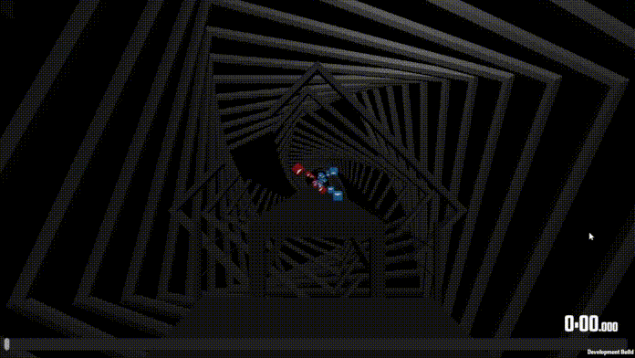

# BeatKenja

Beat Saber automapping tools.
## Installation

### Prerequisites

1. [Java 17](https://www.oracle.com/java/technologies/javase/jdk17-archive-downloads.html)
2. [Python 3.11+](https://www.python.org/downloads/) (Only needed for onset generation)
3. Install pip (only needed for onsets)
    ```bash
    py -m ensurepip --upgrade
    ```
4. Install dependencies (only needed for onsets):

    ```bash
    pip install librosa
    pip install ffmpeg or install it from: https://ffmpeg.org/download.html
    pip install pydub
    ```

### Installation

1. Download newest .jar file from [Releases](https://github.com/Chrisvenator/BeatKenja/releases). You may put it into it's own folder. It will generate a few files

2. Open BeatKenja.jar and let it create a few files and folders. Then close it again.

3. open config.txt and change the defaultPath to your WIP folder (or whatever folder you may like). **replace the backward slashes with forward ones!!!**
   Verbose shouldn't be changed except if you want to get spammed by the program

4. Now you are ready to go

## How to use

<pre>Note that I may be using map and diff interchangeably because me dumb D:</pre>

### Onset Creation

**You need to have all prerequisites installed!**

1. Put all your desired Songs into the folder OnsetGeneration/mp3Files. Note: All your files must be **mp3** files! (.wav files will probably work too).
2. Start BeatKenja and hit Convert "MP3s to timing maps". This will analyze the song and make a timings map. The output will be saved at OnsetGeneration/output/*SongName*.<br>
   The more songs that need to be converted, the longer it will take. You can always review the prgoress when you look into the OnsetGeneration/output folder.
3. Copy all the desired Maps folders from OnsetGeneration/output/ to your WIP folder.
   You can now open your maps in the editor of your choice.
4. Verify the accuracy of the note placements. No algorithm is perfect. So the chance is VERY high that the algorithm placed some notes wrong.

If you now want to make a "real" map out of these timings, then have a look at the next chapter:

----

## Map Generation

### Prerequisites

Prepare a timings and a target difficulty. A timings difficulty [(Example)](./assets/timings.gif) is a diff where every note is a dot note and is located at the bottom left corner. There **MUST ONLY BE BLUE NOTES!!** Or else the program may
not work.<br><br>

If you are unsure to what a timing diff is, then convert an existing diff to a 1 color timing diff and then load it into your editor of your choice.
***It is recommended that the timing diff is a no arrows diff***<br>
<pre>Map to timing notes --> To 1 color timing notes --> SAVE MAP</pre>
<br>The target difficulty should be the diff that you want to export the diff as. For example if you want to create a Expert diff with this program, then you should create a Expert diff in the editor of your choice. You will later overwrite
this diff. THERE WILL BE NO BACKUPS OF THE DIFF YOU OVERWRITE!!
<br>

### Generation

If the timings and target difficulties are prepared, then open BeatKenja.jar and choose the timing diff.<br>
When you click on Map creator you will then have a few options:<br>

+ **Create Linear Map [(Example)](./assets/linear.gif)**:<br>
  A really simple linear map. There should be no DDs or resets. It gets quite boringe quite fast. The swings will **always** be alternating.
  It is possible to make a one handed Linear Map: Map creator --> one han... (top left option)
+ **Create Complex Map [(Example)](./assets/complex.gif)**:<br>
  A map which can contain quite interesting patterns but the swings will **always** be alternating.<br>
  It might conatin DDs or resets. But it will give a warning if it detects some.<br>
  It is possible to make a one handed Complex Map: Map creator --> complex (top right option)
+ **Create Map [(Example)]()**:
  This is where you can have a LOT of freedom.<br>
  With bookmarks, it is possible to create different sections. The supported bookmarks at the moment:
  <pre>complex | linear | 1-2 | 2-1 | 2-2 | small, normal, big jumps | doubles | sequence (WIP)</pre>
  To create a section choose a **bookmark** from the ones above, and name the bookmark accordingly. The color is irrelevant for generating the map.
  Bookmarks can be freely set. There are no real restrictions.
  Just name the bookmark for example "small jump" or "doubles", and it will create a small jump or doubles section.
  A section will go on as long as there are notes in the map or until the next bookmark.
  <br>If a bookmark is directly on a note, then the note will count to the section that begins right there.
  <br>If a bookmark is not supported (or written incorrectly), then it will warn you and use the "complex" in the meantime.

  | **bookmark name & description**                                                                                                                                                                                                                                                                                | **GIF**                                        |
  |----------------------------------------------------------------------------------------------------------------------------------------------------------------------------------------------------------------------------------------------------------------------------------------------------------------|------------------------------------------------|
  | **`linear`**<br>Linear quite boring pattern                                                                                                                                                                                                                                                                    |              |
  | **`complex`**<br>A little bit more complex patterns. But nothing too complex.<br>**THERE MAY BE RESETS AND DDs**. So always check the map!                                                                                                                                                                     |            |
  | **`1-2`**<br>Twice as many blue notes as red notes.<br>The red note will always spawn at the same beat as the blue one.<br>In between red notes there will always be a blue note.<br><br>Red notes generate like "linear" and blue notes generate like "complex".                                              |                    |
  | **`2-1`**<br>**<ins>Same as "1-2" but mirrored</ins>**<br>Twice as many red notes as blue notes.<br>The blue note will always spawn at the same beat as the red one.<br>In between blue notes there will always be a red note.<br><br>blue notes generate like "linear" and red notes generate like "complex". |                    |
  | **`2-2`**<br>There will be 2 blue notes followed by 2 red notes followed by 2 blue notes followed by...<br>Depending on the starting position of the first red and blue note, both notes may or may not be feel weird.                                                                                         |                    |
  | **`doubles`**<br>Red and Blue note will be placed at the same beat.<br>Dpeding on the previus notes they may be both the same or both different swings                                                                                                                                                         |          |
  | **`small jumps`**<br>Depending on the previous notes the blue or red note comes first                                                                                                                                                                                                                          |    |
  | **`normal jumps`**<br>Depending on the previous notes the blue or red note comes first                                                                                                                                                                                                                         |  |
  | **`big jumps`**<br>Depending on the previous notes the blue or red note comes first<br>*Currently broken D:*                                                                                                                                                                                                   |        |
  | **`sequence`**<br>*Currently under construction*                                                                                                                                                                                                                                                               | *to be added*                                  |

<br>

Then at last, hit SAVE MAP and select the target difficulty that you created earlier and hit save.<br>
BE AWARE! THERE WILL BE **NO BACKUPS** OF THE OVERWRITTEN DIFFICULTY!! Check twice if you overwrite the **right** diff!

### Pattern customisation

It is possible to change the patterns of "Create Complex Map" and "Create Map".
There is a button named "load patterns". just simply load a .dat file and watch the patterns change.

TODO: Explain what load patterns does<br>

----

## Map Utilities

+ **Make diff into a no arrow diff**
+ **Convert all flashing lights**<br>
  This converts all flashing light events into regular on events.
+ **Delete Note Type**. Blue: 1 and Red: 0
+ **fix Placements**
  This moves all placements to (by default) 1/16 of a beat

----

## Known Issues:

+ **V3 Maps are not supported** YET
+ **There are holes in the map:** No Algorithm is perfect. But I will fix that sometime in the future
+ **Map won't load in Beat Saber:** There may be something wrong with a difficulty file. Just go into the editor of your choice and open and save every difficulty. That should fix it.
+ **The map I generated doesn't show up in the editor:** TBD
+ **The map didn't change after generating a new one:** There may be 2 possibilities:
    1. The Program didn't feel like generating something
    2. Chromapper caches difficulties. If this is the case, then exit and reopen the diff. that should fix it.

----

## TODOs:

- [ ] creating new pattern types:
    - [x] doubles
    - [x] (small, normal big) jumps
    - [ ] saving and loading patterns (or Squences as I called them because me dumb)
    - [ ] more variation
    - [ ] stacks
- [ ] Better music onsets
- [x] Dark Mode
- [x] Finish README.MD
- [x] FIX BIG JUMPS
- [ ] add V3 support
