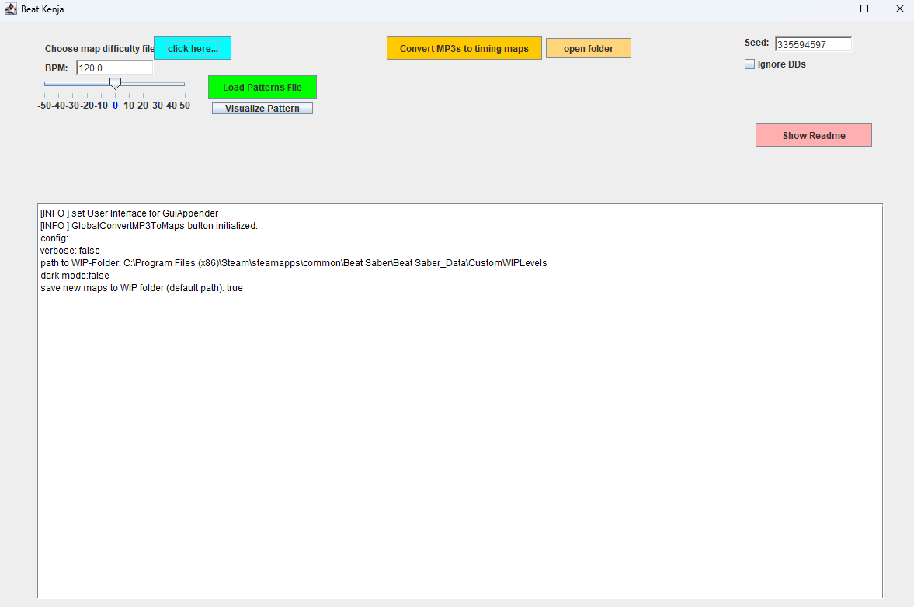
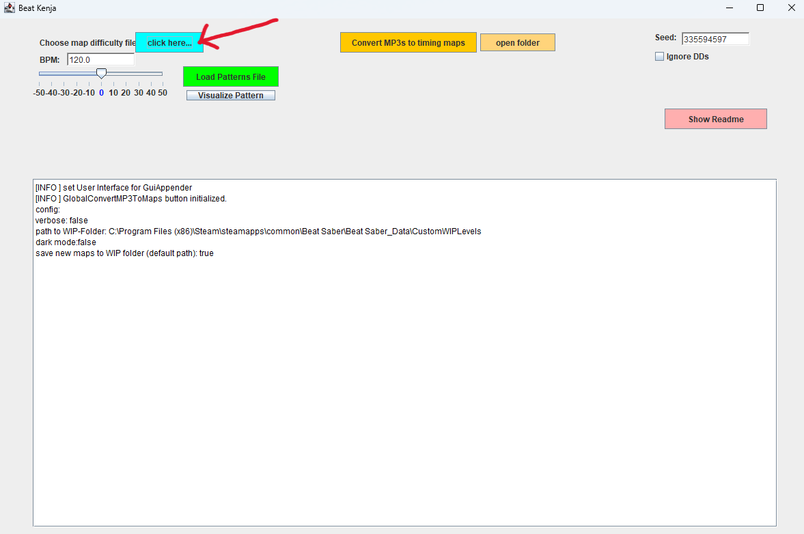
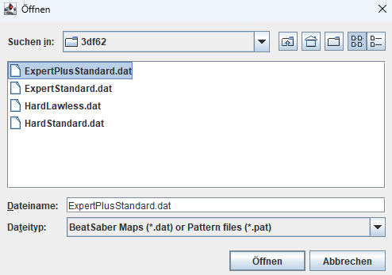
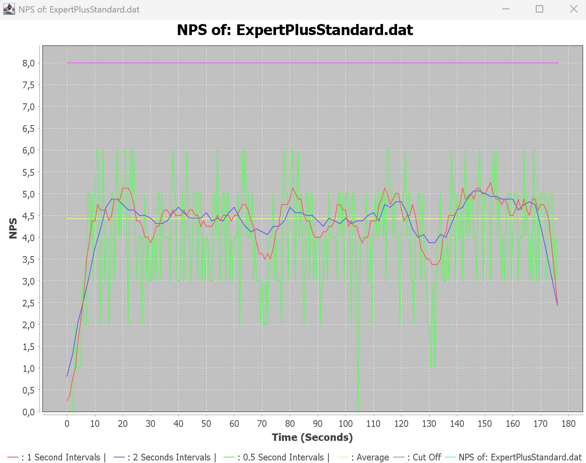
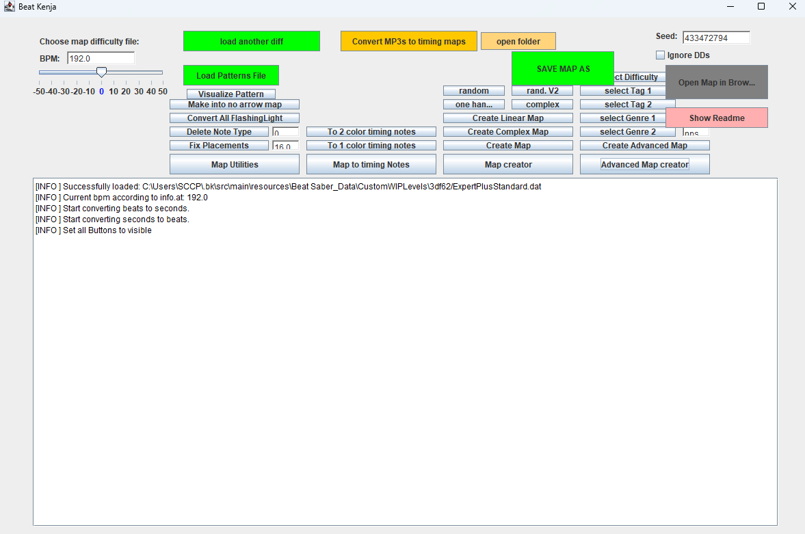

# Tutorial for the Userinterface

### TLDR
For a single difficulty, load the difficulty/map folder, Press Map Creator, select the option you want, wait until it's finished and then press "Save".   

## Prerequisites

If everything is set up correctly, you should see this screen:

You have the following options:
- **Create a map form an existing map/difficulty.** More on that later
- **Load a custom patterns file.** Based on the .pat file, other patterns will be used and the resulting map will be different.
- **Adjust the rate of how unique/repetitive the generated map will be** by using the slider.
- **Visualize the patterns** that are used to generate the map. This is useful to understand how the patterns work and how they are applied. This is an advanced option. You will probably not need it.
- **Show the Readme** of the project. It explains the different options and how to use them.
- **Create new maps from scratch** by providing mp3 file. With the "**Open Folder**" button you can select a folder with mp3 files. The "**Generate Map**" button open the folders where the mp3 files should be located to create a map from it.

## Create a map from an existing map/difficulty
Click this button.

You will be prompted to select a file. The file should be a .json file (old map format) or .dat file (new map format) that contains the map data.  
Additionally, you can also select a folder. This will later create a map for each difficulty file in the folder.

This will open two windows: 
1. nps Plotter
2. Main window

### NPS Plotter
This is an advanced feature. You will probably not need it.

It is a window that shows the nps (notes per second) distribution of the map. This is useful to understand how the map is paced.
It is used in the "Advanced Map Generation" where faster sections will have less variation and are simpler. 

The yellow line shows the avarage nps throughout the map. The blue line shows the avarage every two seconds, the red shows the avarage every 1 second. The green line shows the avarage every 0.5 seconds. This is useful to see how the map is paced and how the nps changes over time.
The purple line shows the cutoff for the nps. If the nps is below this line, the sections will be considered as "slow" and will be generated with more variation. If the section's nps is above this line, the map will be considered as "fast" and will be generated with less variation.

### Main window
The main window is where you can actually create maps. It is a lot of information at once, but you will get used to it.  
There are 4 big blue-ish buttons:
1. **Map utilities**: Basic utilities to modify the map. See the main [README](../README.md) for further information.
2. **Map to timing notes**: Create timing notes from the map. Either only blue notes or blue and red notes.
3. **Map creator**: This will take the notes of the current map as timings and create a new map from it. If you chose a folder, it will create a map for each difficulty file in the folder. The generated map will be stored internally. To get it onto your computer, you must press the **"SAVE"**-button!   Please look at the [README](../README.md#generation) for more information on how to use the different options of the map creator.
4. **Advanced Map Creator**: This is works almost the same as above. It has some additional experimental functionality. It is not recommended to use this feature, as it is still in development and may not work as expected, if at all.  

## Saving the map.
When you generate a map, it is stored internally. To get it onto your computer, you must press the **"SAVE"**-button in the top right corner.  
**WARNING**! If you just save your map, it will overwrite the existing map file!!! There will be a warning dialog if you would overwrite a file. If you want to overwrite the file, then press "YES". If you want to create a backup of the old file, then press "create backup".

# Patterns
You can also load a custom patterns file. This is a .pat file. Different .pat files will result in different patterns being used to generate the map which results in different patterns inside the map.  
You can also visualize the pattern that is currently in use by pressiing "visualize Patterns" and then choosing the desired option.  
_Note that this is an advanced feature and you will probably not need it._

# Batch Convert mp3s to maps
If you want to create maps from mp3 files, you can do so by providing with mp3 files in the correct folder.  
To get to that folder, you can press the "Open Folder" button. This will open the folder where the mp3 files should be located.  
Once you have placed the mp3 files in the folder, you can press the "Generate Map" button. This will create a map for each mp3 file in the folder.  
_Note that the more files you have in the folder, the longer it will take to generate the maps. It is recommended to use a small number of files for testing purposes._  